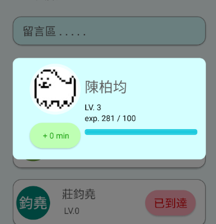

# app操作畫面

- 打開app時會先進到這個這個主畫面，上方是自己的個人檔案，顯示等級和經驗值。
- 下方的活動清單會顯示預定的活動，並提醒建議的出發時間，如果已經過了建議的出發時間，就會改為顯示多久後抵達。右下方的加號可以新增活動。
<!-- - { height=50% } -->
- 
---
- 旁邊的 +0 min按鈕會顯示最近的活動紀錄。如果經常遲到會留下鮮明的紅色紀錄，別人看到的時候就會很尷尬，促使自己準時。
<!-- -  -->
- 
---
- 你可以選擇自己新增一個活動，或是透過房間號碼進入別人的活動
<!-- -  -->
- 
---
- 在編輯的頁面中，上方可以輸入相關資訊。下方可以選擇使用哪種交通工具
- 選取地點功能，結合Google Map計算建議出發時間及路線。
<!-- -  -->
- 
---
- 當其他人經由房間號碼進入你的活動時，畫面中間會顯示參與者，以及他預計抵達的時間。如果預計會遲到的話，旁邊的抵達時間就會變成紅色的。
<!-- -  -->
- 
---
- 也可以點擊參加者，可以看到他的平均遲到時間。
<!-- -  -->
- 
---
- 最後，點擊中間的留言區，會跳出記事本以供留言，預防緊急情況。
<!-- -  -->
- 
---
- 最初prototype，與最後設計(上面)畫面有些微不同，但大致功能相同
- 
<!-- -  -->
